# Introduction to IBM Edge Application Manager - IEAM

Introduction to IBM Edge Application Manager - Think 2021 Lab #2122 workbook

Successfully deploy models to the edge using IBM Edge Application Manager workload orchestration

## Introduction

Gain hands-on experience with the IBM Edge Application Manager web management console. Install the Horizon agent, then deploy and manage a Horizon edge service on your edge device.

This Code@Think lab session is available for IBM Think 2021 conference attendees (Sign up for Free!)
- Wednesday, May 12, 2021 3:00 PM to 5:00 PM EDT

## Prerequistes

- Create a free [IBM Cloud account](https://cloud.ibm.com/registration)
- [Sign up](https://ibm.app.swapcard.com/event/think21) for [Think 2021](https://www.ibm.com/events/think/)
- Register for the [Introduction to IEAM lab](https://ibm.app.swapcard.com/event/think21/planning/UGxhbm5pbmdfNDQyMTk4)
- Join us on Wednesday, May 12, 2021 3:00 PM to 5:00 PM EDT

## Lab Objectives

- Access the Think 2021 Lab virtual machine environment
- Learn about IEAM components
- Explore the IEAM web console
- Register an Edge node
- Experiment with the hzn command line interface
- Configure IEAM Services and Policies
- Deploy containerized workloads to your edge device

## Access to the Think 2021 Lab Environment

- Select **sysadmin**
  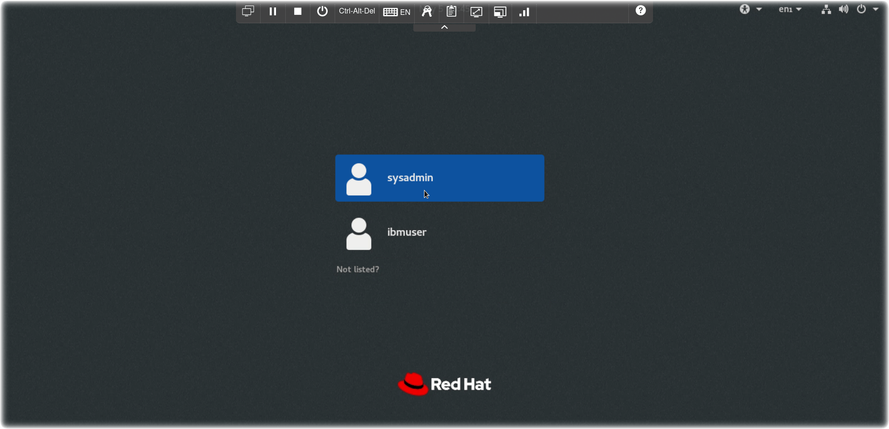

- Login Credentials for the virtual machine are stored in the toolbar
- Click on the **Keys** icon in the top toolbar
  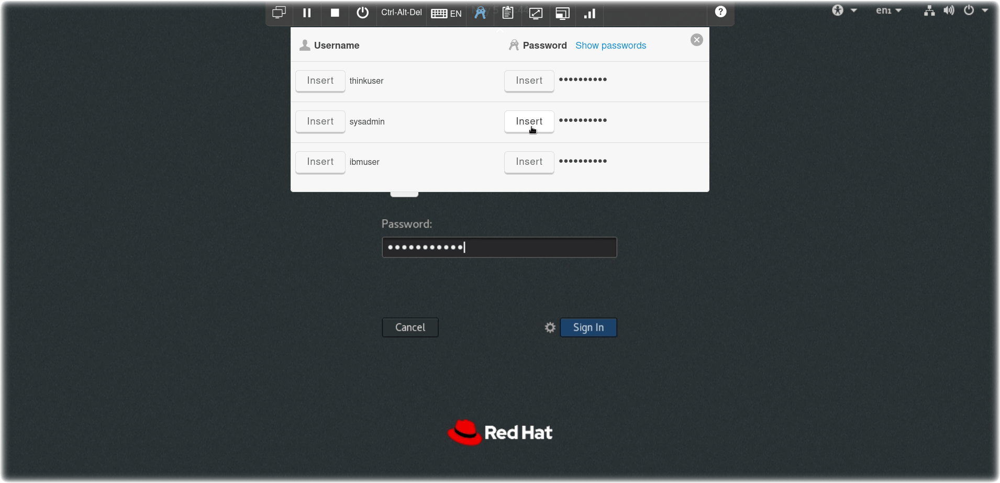

- A drop down dialog will appear with various credentials used in this lab
- Click on the **Insert** button for the sysadmin password
- Click on the **Sign In** button

### Navigating the Virtual Machine

This lab will use several components within the RHEL Gnome desktop environment:
- Review the desktop
  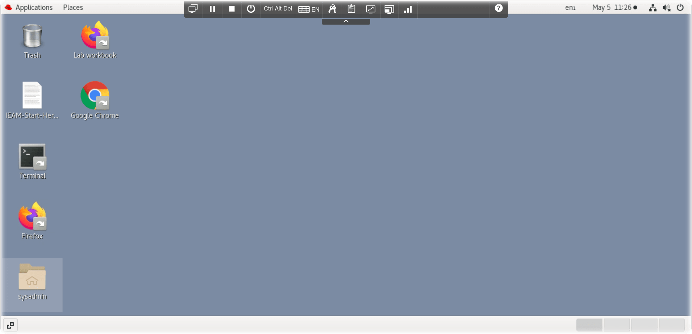

- a terminal window to execute `hzn` Horizon edge agent commands
- a browser window with access to the IBM Edge Application Manager web console
- this GitHub repository / PDF which provides exercises to learn about IEAM, the Horizon agent, and containerized edge workloads
- Select the Lab workbook Firefox icon (if you prefer Chrome, select the Chrome icon and then open the 'Lab Workbook' from the bookmark bar)
- The browser will open to the [Introduction to IBM Edge Application Manager - IEAM](https://github.com/johnwalicki/Introduction-to-IEAM) github repo

### IEAM Component Definitions

Before proceeding to the lab instructions, let's review some IEAM component definitions.

*IEAM Management Hub* - The web UI used by IEAM administrators to view and manage the other components of IBM Edge Application Manager.

*Node* - Typically, **edge devices** have a prescriptive purpose, provide (often limited) compute capabilities, and are located near or at the data source. Currently [supported IEAM edge device OS and architectures](https://www.ibm.com/docs/en/edge-computing/4.2?topic=devices-preparing-edge-device#suparch-horizon):

- x86_64
  - Linux x86_64 devices or virtual machines that run Ubuntu 20.x (focal), Ubuntu 18.x (bionic), Debian 10 (buster), Debian 9 (stretch)
  - Red Hat Enterprise Linux® 8.2
  - Fedora Workstation 32
  - CentOS 8.2
  - SuSE 15 SP2
- ppc64le (support starting Horizon version 2.28)
  - Red Hat Enterprise Linux® 7.9
- ARM (32-bit)
  - Linux on ARM (32-bit), for example Raspberry Pi, running Raspberry Pi OS buster or stretch
- ARM (64-bit)
  - Linux on ARM (64-bit), for example NVIDIA Jetson Nano, TX1, or TX2, running Ubuntu 18.x (bionic)
- Mac
  - macOS

*Containerized Workload* - Any Docker/OCI containerized service, microservice, or piece of software that does meaningful work when it runs on an edge node.

*Service* - A service that is designed specifically to be deployed on an edge cluster, edge gateway, or edge device. Visual recognition, acoustic insights, and speech recognition are all examples of potential edge services.

*Pattern* -

*Policy* -

*IEAM Edge Cluster* - IBM Edge Application Manager (IEAM) [edge cluster capability](https://www.ibm.com/docs/en/edge-computing/4.2?topic=nodes-edge-clusters) helps you manage and deploy workloads from a management hub cluster to remote instances of OpenShift® Container Platform or other Kubernetes-based clusters. Edge clusters are IEAM edge nodes that are Kubernetes clusters. An edge cluster enables use cases at the edge, which require colocation of compute with business operations, or that require more scalability, availability, and compute capability than what can be supported by an edge device.  IEAM edge cluster configuration is outside the scope of this introduction lab.

## Architecture

The goal of edge computing is to harness the disciplines that have been created for hybrid cloud computing to support remote operations of edge computing facilities. IEAM is designed for that purpose.

The deployment of IEAM includes the management hub that runs in an instance of OpenShift Container Platform installed in your data center. The management hub is where the management of all of your remote edge nodes (edge devices and edge clusters) occurs.

These edge nodes can be installed in remote on-premises locations to make your application workloads local to where your critical business operations physically occur, such as at your factories, warehouses, retail outlets, distribution centers, and more.

The following diagram depicts the high-level topology for a typical edge computing setup:


## Let's Get Started

### Explore the IEAM web console

In this section, explore the IEAM mgmt web console.

- Click either the Firefox or Chrome browser icon on your desktop
  - **Note** if you select Chrome, launch IBM Edge Application Manager from the browser toolbar. You will also need to click on the Advanced button and proceed to the self-signed certificate. Choose Default Authenication.
- Login into the IEAM console
  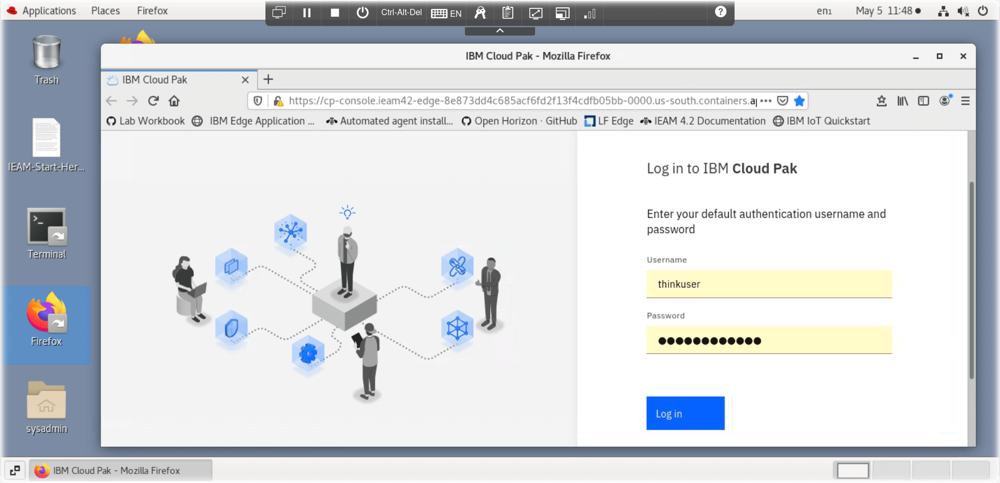
- The `thinkuser` userid / password are already saved in your browser keystore but if you need to, use the **Keys** toolbar to insert the password.
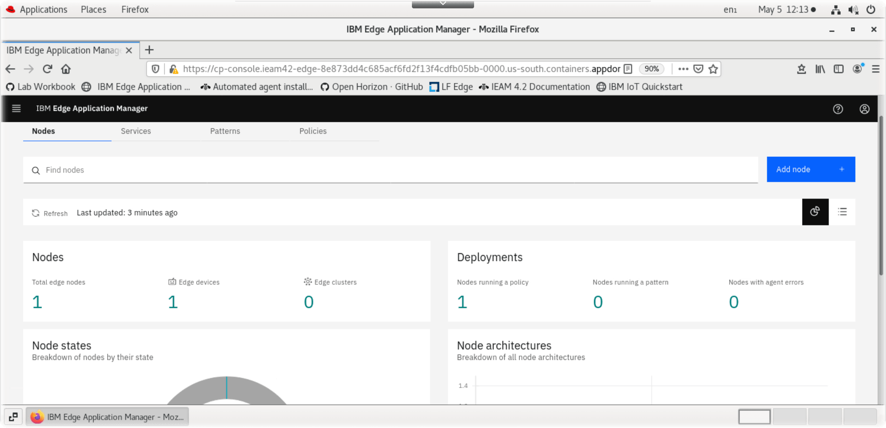
- **Note:** If you receive a `403` error, modify the browser URL in the address bar, remove the `common-nav/403` and replace it with `edge`
- Nodes
  - Manage the node properties and constraints
  - **Note** there are only a few edge nodes registered. In a subsequent section of the lab, your edge node will appear here.
  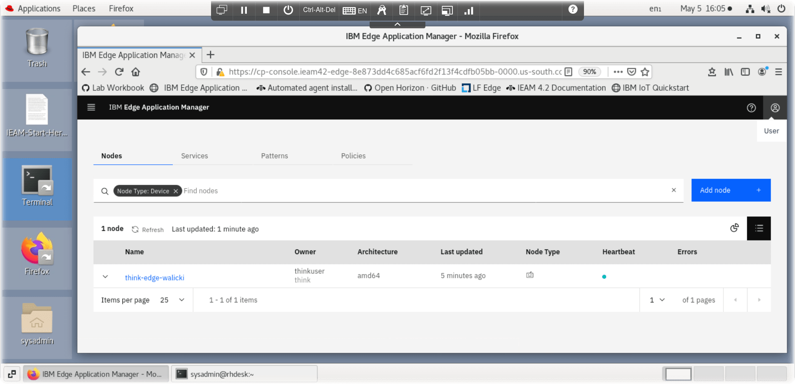
- Services
  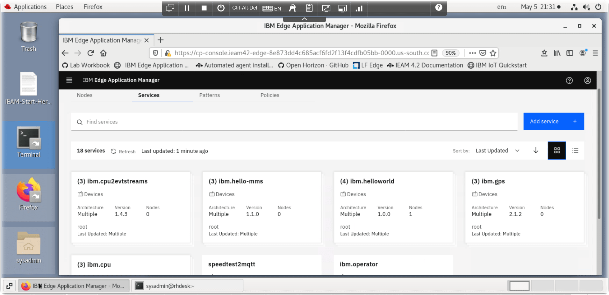
- Patterns
  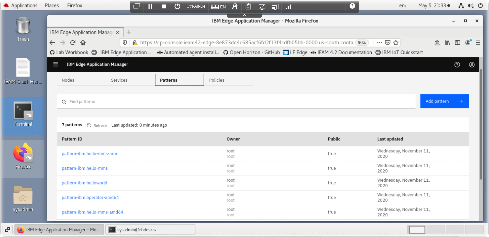
- Policies
  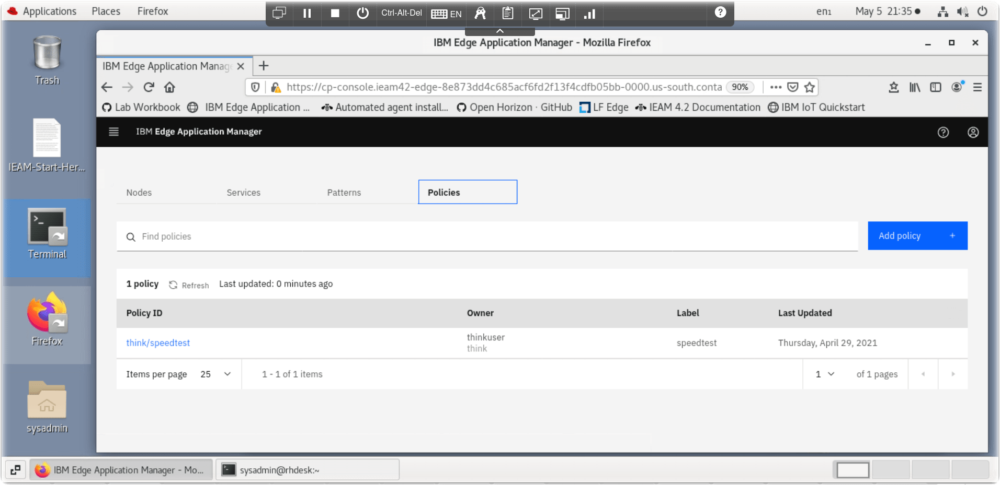

### Explore the "Edge" Device

The virtual machine lab environment provided during the Think 2021 lab will be your "edge device" today. Normally, your edge device might be an industrial computer, small board computer, etc.

- Click on the **Terminal** icon and launch a console window.
  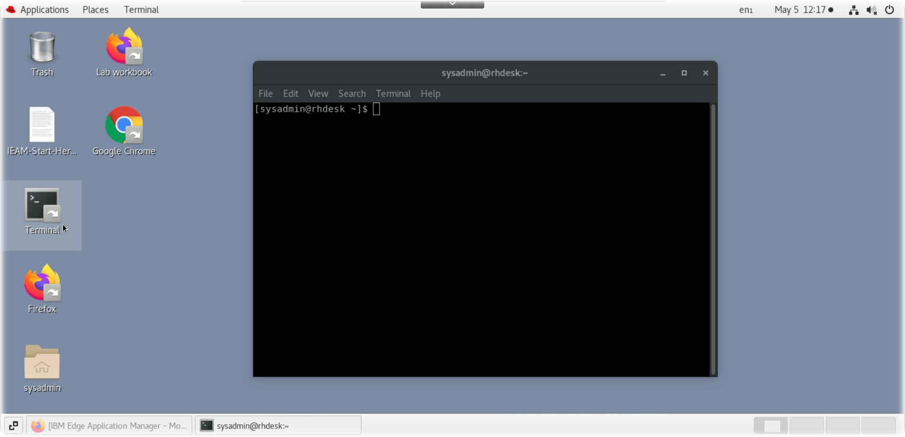

- To simplify the edge lab setup, the HZN environment variables have been pre-configured in the ~/.bashrc profile
- Inspect the HZN environment variables by entering this shell pipeline

  ```sh
  export | grep HZN
  ```

  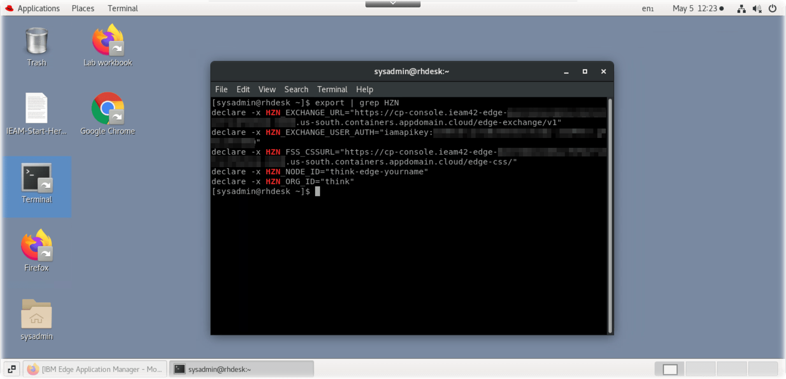 **Note:** (the urls and iamapikey have been blurred in the public screenshots)

- Set your HZN_NODE_ID environment variable to something unique which will allow you to find your "edge" device in the IEAM management console.  eg `think-edge-<yourname>`

   ```sh
   export HZN_NODE_ID=think-edge-<yourname>
   ```

   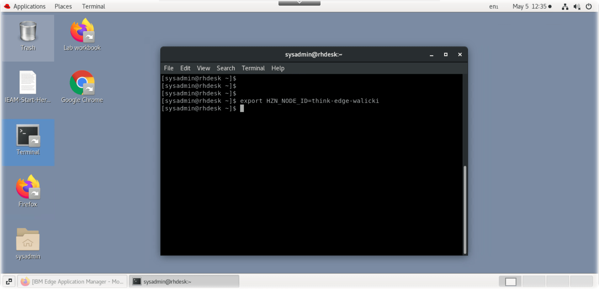

- **Stop** : Did you `export HZN_NODE_ID=think-edge-<yourname>` as required in the above step?  You won't be able to find your device in the IEAM mgmt console if you don't set a node name.
- Install / Register your edge node

  ```sh
  sudo -s -E ./agent-install.sh -i 'css:' -p IBM/pattern-ibm.helloworld -w '*' -T 120
  ```

  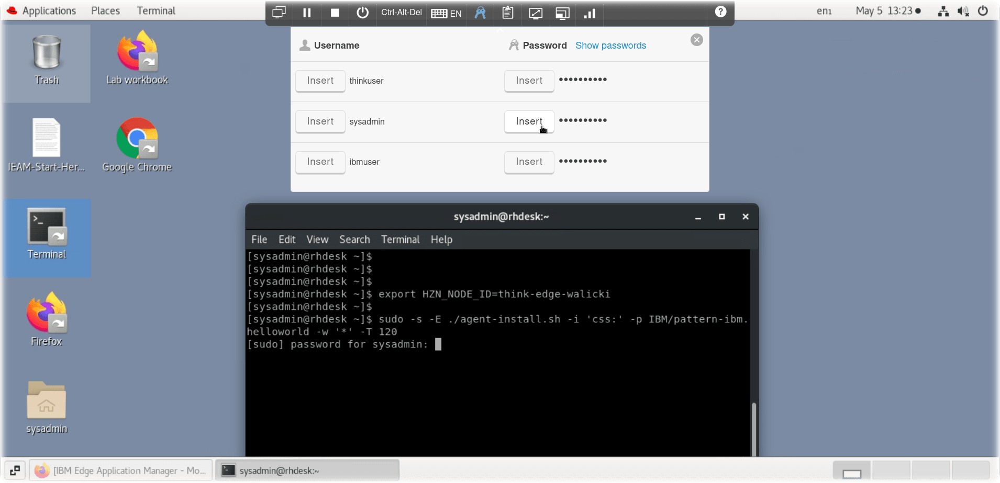
  Use the **Keys** toolbar to insert the `sysadmin` password at the `sudo` prompt

- When the node registration completes, it will have also configured an `IBM/ibm.helloworld` pattern to execute on this node.
  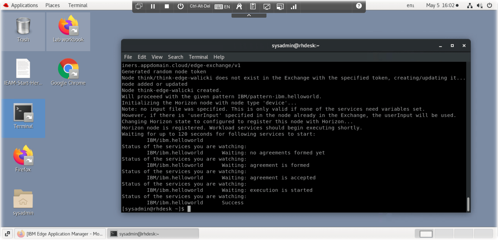

- Return to the IEAM web console.  Refresh, Find your device
  
- If you don't see your node, or you skipped the step which sets the name of your edge node, `export HZN_NODE_ID=think-edge-<yourname>` , you can unregister the node and try again.

  ```sh
  sudo hzn unregister -vrfD
  export HZN_NODE_ID=think_edge_<yourname>
  sudo -s -E ./agent-install.sh -i 'css:' -p IBM/pattern-ibm.helloworld -w '*' -T 120
  ```

- Return to the Terminal window. See what agreements are running.

  ```sh
  hzn agreement list
  ```

  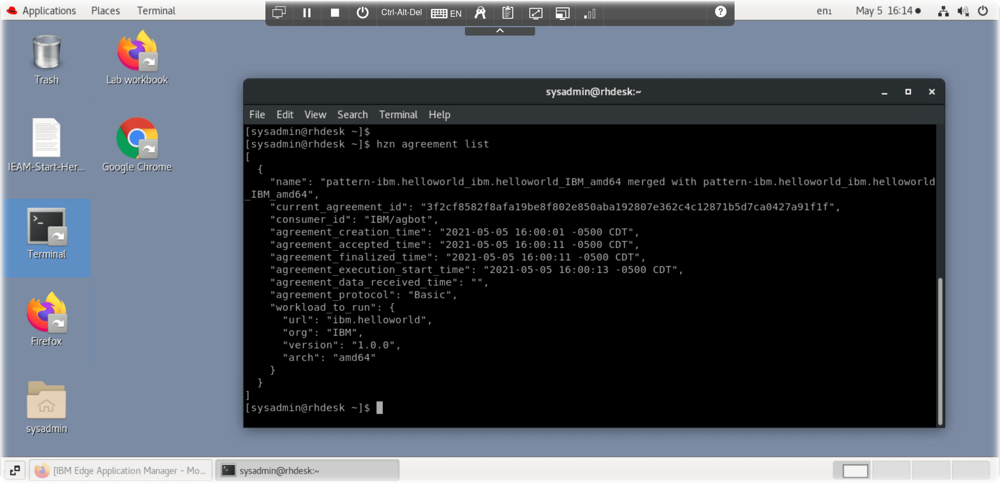

- Query details about your node

  ```sh
  hzn node list
  ```

  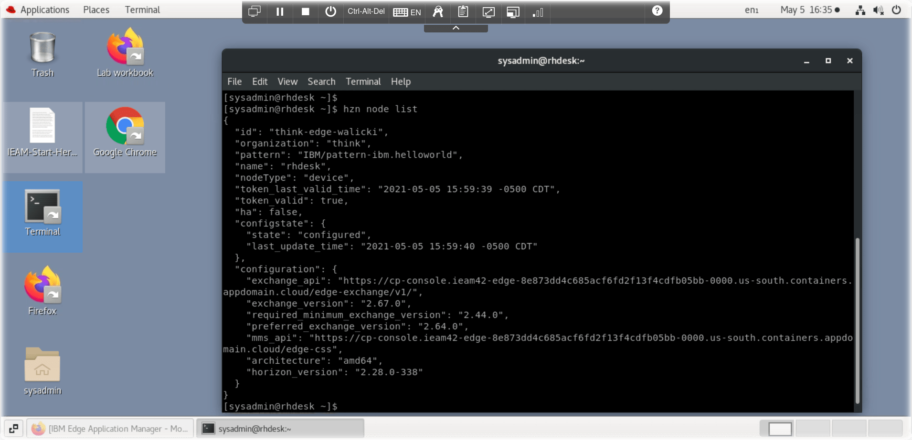

### Using the Horizon HZN command line
The IEAM management hub installation includes several services which have been published into the exchange automatically. The following commands will list the services, patterns, and deployment policies available in your exchange:

**Note:** The following commands assume you have the Horizon environment variables `HZN_ORG_ID` and `HZN_EXCHANGE_USER_AUTH` set

```sh
hzn exchange service list IBM/
```

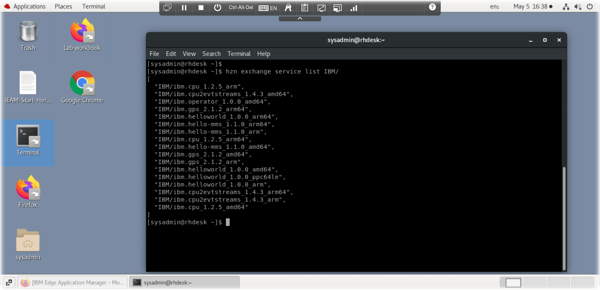

```sh
hzn exchange pattern list IBM/
```

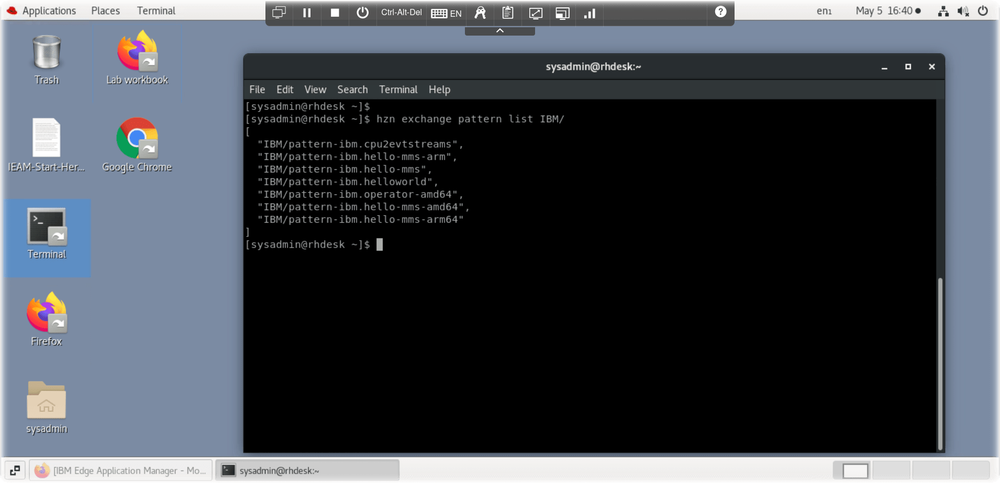

```sh
hzn exchange deployment listpolicy
```


- Review the event log for this node.

```sh
hzn eventlog list
```

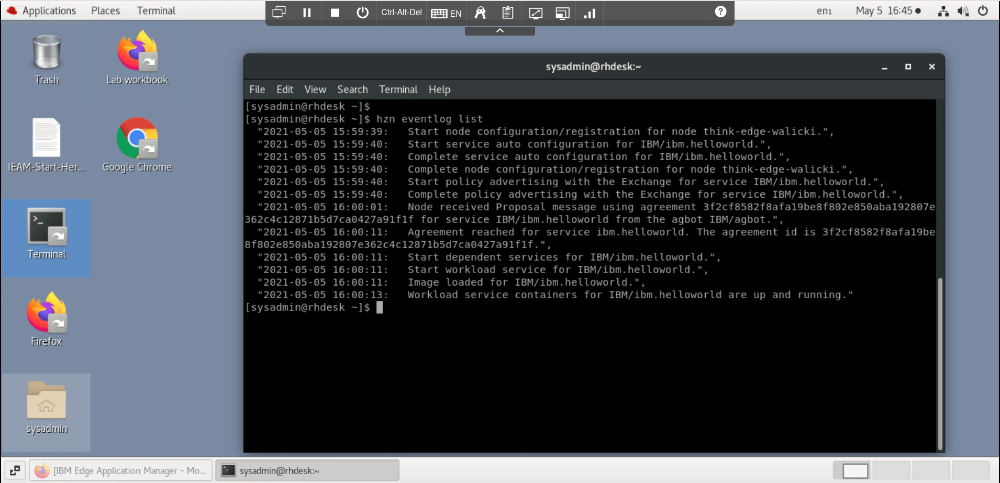

## Web Hello containerized workload

Create a Web Hello service

- intro to the web-hello service
- https://github.com/MegaMosquito/web-hello
- cli
- node properties
- Open a browser to the port

## SpeedTest to MQTT containerized workload

- Intro to the Speedtest workload
- Create a SpeedTest service, screenshots
- Open a Browser to QuickStart
- Enter your HZN node id

## Additional Resources
https://www.lfedge.org/projects/openhorizon/
https://github.com/open-horizon/
https://www.ibm.com/docs/en/edge-computing/4.2
https://www.ibm.com/docs/en/edge-computing/4.2?topic=agent-automated-installation-registration
https://github.com/open-horizon/examples

### Author

- [John Walicki](https://github.com/johnwalicki/)

___

Enjoy!  Give me [feedback](https://github.com/johnwalicki/Introduction-to-IEAM/issues) if you have suggestions on how to improve this lab workbook.

## License

This lab workbook is licensed under the Apache Software License, Version 2.  Separate third party code objects invoked within this lab are licensed by their respective providers pursuant to their own separate licenses. Contributions are subject to the [Developer Certificate of Origin, Version 1.1 (DCO)](https://developercertificate.org/) and the [Apache Software License, Version 2](http://www.apache.org/licenses/LICENSE-2.0.txt).

[Apache Software License (ASL) FAQ](http://www.apache.org/foundation/license-faq.html#WhatDoesItMEAN)